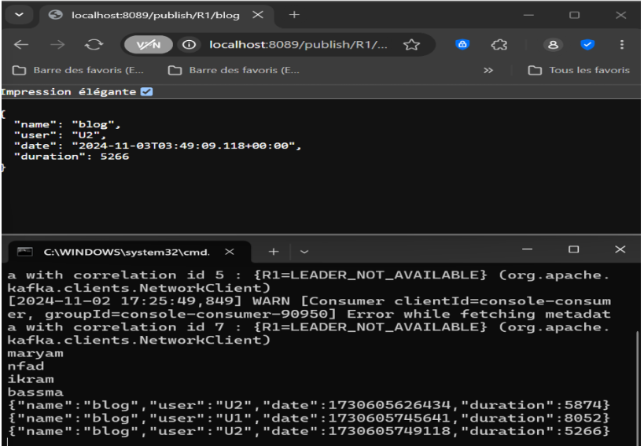

# Architecture Événementielle avec Kafka - Activité Pratique

Ce projet met en œuvre une architecture événementielle utilisant Apache Kafka et Spring Cloud Streams, avec un traitement des données en temps réel. L'application inclut des services Kafka pour la production, la consommation, la fourniture de données, et l'analyse en temps réel.

Installation de Kafka

1- Téléchargez Kafka depuis le site officiel Apache Kafka.

2- Démarrez les services suivants :
    Zookeeper : bin/zookeeper-server-start.sh config/zookeeper.properties
    Broker Kafka : bin/kafka-server-start.sh config/server.properties
3- Testez Kafka avec :
    Producteur Console : bin/kafka-console-producer.sh --topic [NOM_DU_TOPIC] --bootstrap-server localhost:9092
    Consommateur Console : bin/kafka-console-consumer.sh --topic [NOM_DU_TOPIC] --from-beginning --bootstrap-server localhost:9092


## Aperçu du TP
L'application est conçue en utilisant Spring Cloud Streams pour s'intégrer facilement avec Kafka. Voici les principaux composants du projet :

1. Service Producteur Kafka
   Un contrôleur REST expose des API pour envoyer des événements aux topics Kafka.
   Les topics sont définis dans le fichier application.properties.
2. Service Consommateur Kafka
   Consomme les événements depuis les topics Kafka et les traite.
   Les configurations pour les groupes de consommateurs et les topics sont gérées dans le fichier de propriétés.
3. Service Fournisseur Kafka
   Un service fournisseur qui envoie des événements de façon continue à un topic Kafka avec un délai fixe.
4. Analyse en Temps Réel avec Kafka Streams
   Implémente une logique d’analyse des flux.
   Filtre et compte les événements basés sur leur durée (> 100 ms).
5. Application Web
   Une interface REST qui affiche les résultats d’analyse des données Kafka Streams.
   Flux de données fourni au format Server-Sent Events (SSE)

## Structure du Projet


## Code du Projet
### Classe PageEvent
```
package nfad.maryam.demospringcloudstreamskafka.entities;

import lombok.AllArgsConstructor;
import lombok.Data;
import lombok.NoArgsConstructor;
import lombok.ToString;

import java.util.Date;

@Data
@NoArgsConstructor
@AllArgsConstructor
@ToString
public class PageEvent {
    private String name;
    private String user;
    private Date date;
    private long duration;
}

```
### Service PageEventService
```
@Service
public class PageEventService {
@Bean
public Consumer<PageEvent> pageEventConsumer() {
return (input) -> {
System.out.println("*************************");
System.out.println("Received event: " + input.toString());
System.out.println("*************************");
};
}

    @Bean
    public Supplier<PageEvent> pageEventSupplier() {
        return () -> new PageEvent(
                Math.random() > 0.5 ? "P1" : "P2",
                Math.random() > 0.5 ? "U1" : "U2",
                new Date(),
                new Random().nextInt(9000)
        );
    }

    @Bean
    public Function<PageEvent, PageEvent> pageEventFunction() {
        return (input) -> {
            input.setName("L:" + input.getName().length());
            input.setUser("UUUUUU");
            return input;
        };
    }

    @Bean
    public Function<KStream<String, PageEvent>, KStream<String, Long>> kStreamFunction() {
        return (input) -> {
            return input
                    .filter((k, v) -> v.getDuration() > 100)
                    .map((k, v) -> new KeyValue<>(v.getName(), 0L))
                    .groupBy((k, v) -> k, Grouped.with(Serdes.String(), Serdes.Long()))
                    .windowedBy(TimeWindows.of(Duration.ofMillis(500)))
                    .count()
                    .toStream()
                    .map((k, v) -> new KeyValue<>("=>" + k.window().startTime() + k.window().endTime() + k.key(), v));
        };
    }
}
```
### Contrôleur REST PageEventRestController
```
@RestController
public class PageEventRestController {
@Autowired
private StreamBridge streamBridge;

    @Autowired
    private InteractiveQueryService interactiveQueryService;

    @GetMapping("/publish/{topic}/{name}")
    public PageEvent publish(@PathVariable String topic, @PathVariable String name) {
        PageEvent pageEvent = new PageEvent(
                name,
                Math.random() > 0.5 ? "U1" : "U2",
                new Date(),
                new Random().nextInt(9000)
        );
        streamBridge.send(topic, pageEvent);
        return pageEvent;
    }

    @GetMapping(value = "/analytics", produces = MediaType.TEXT_EVENT_STREAM_VALUE)
    public Flux<Map<String, Long>> analytics() {
        return Flux.interval(Duration.ofSeconds(1))
                .map(seq -> {
                    Map<String, Long> map = new HashMap<>();
                    ReadOnlyKeyValueStore<String, Long> stats = interactiveQueryService.getQueryableStore("count-store", QueryableStoreTypes.keyValueStore());
                    KeyValueIterator<String, Long> keyValueIterator = stats.all();
                    while (keyValueIterator.hasNext()) {
                        KeyValue<String, Long> next = keyValueIterator.next();
                        map.put(next.key, next.value);
                    }
                    return map;
                });
    }
}
```
### Classe Principale

``` 

@SpringBootApplication
public class DemoSpringcloudStreamsKafkaApplication {
    public static void main(String[] args) {
        SpringApplication.run(DemoSpringcloudStreamsKafkaApplication.class, args);
    }
}
```

## Configuration des Propriétés
Définissez les propriétés suivantes dans le fichier application.properties :
```
spring.cloud.stream.bindings.pageEventConsumer-in-0.destination=R1
server.port=8089
spring.cloud.stream.bindings.pageEventSupplier-out-0.destination=R2
spring.cloud.function.definition=pageEventConsumer;pageEventSupplier;pageEventFunction;kStreamFunction
spring.cloud.stream.poller.fixed-delay=100
spring.cloud.stream.bindings.pageEventFunction-in-0.destination=R2
spring.cloud.stream.bindings.pageEventFunction-out-0.destination=R3
spring.cloud.stream.bindings.kStreamFunction-in-0.destination=R2
spring.cloud.stream.bindings.kStreamFunction-out-0.destination=R4
spring.cloud.stream.kafka.streams.binder.configuration.commit.interval.ms=1000
```

## Execution 

